<div align="center">

# 🚆 Scalable Railway Reservation System on AWS

### High Availability • Auto Scaling • Serverless Ticket Generation • Temporary Seat Locking

A cloud-native Railway Reservation System built using AWS services to simulate an **IRCTC-like booking platform** capable of handling high traffic (Tatkal bookings) with scalable infrastructure, automated ticket generation, and cloud-native monitoring.


</div>

---

## 🖼 Demo Screens

<table>
  <tr>
    <td align="center">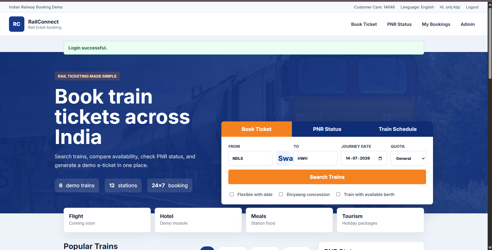</td>
    <td align="center">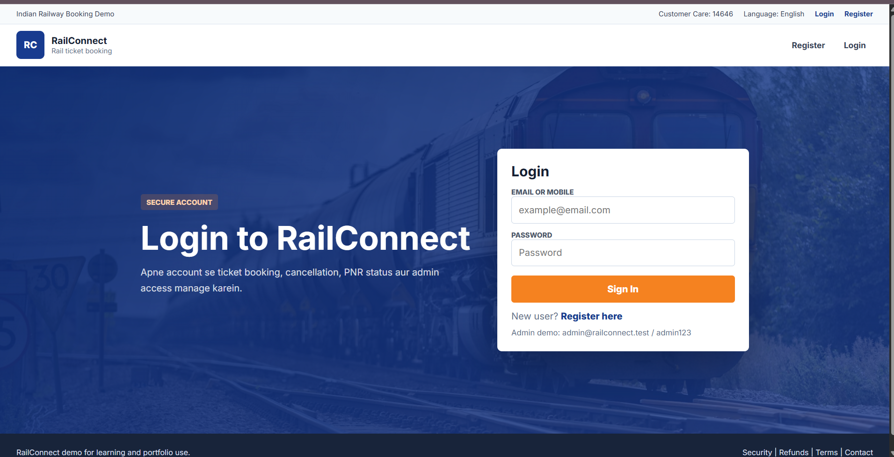</td>
  </tr>
  <tr>
    <td align="center">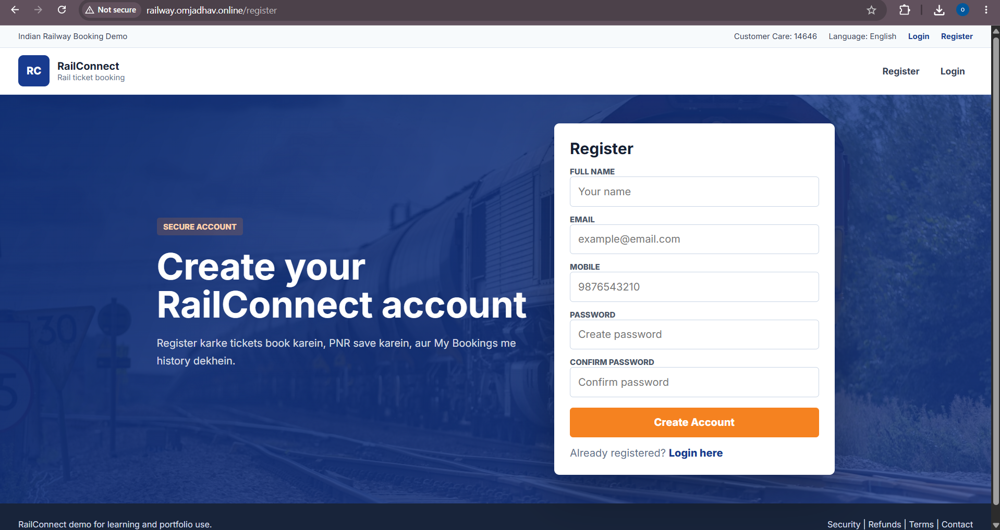</td>
    <td align="center">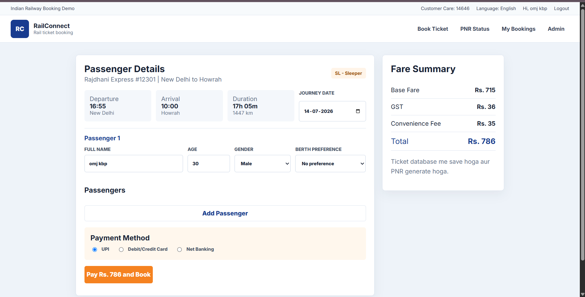</td>
  </tr>
  <tr>
    <td align="center">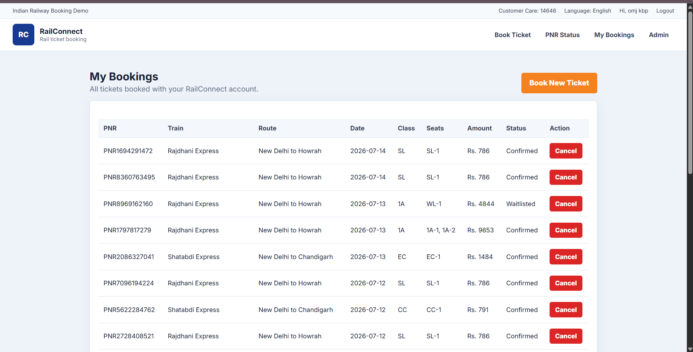</td>
    <td align="center">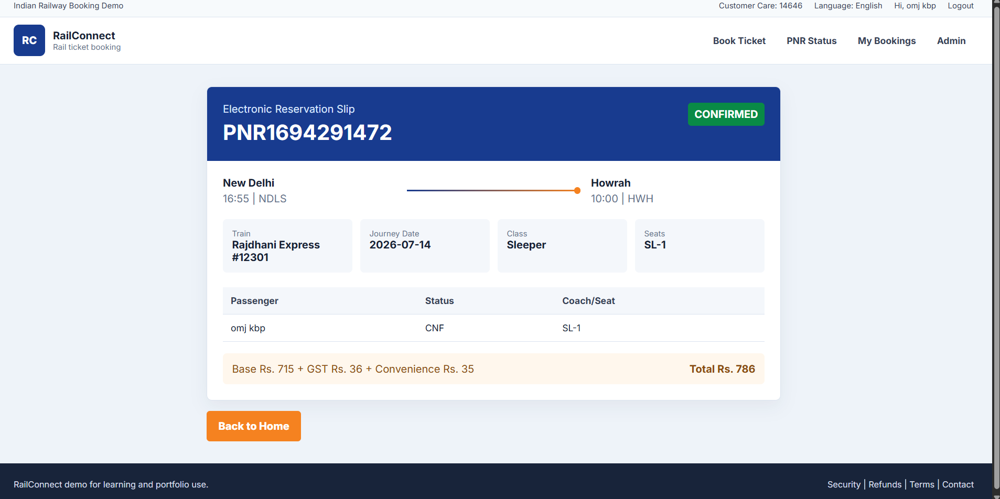</td>
  </tr>
</table>

---

# 📌 Project Overview

This project demonstrates a **scalable Railway Reservation System** deployed on AWS.

It is designed to:

- 🔍 Search trains
- 🎫 Book railway tickets
- 🔒 Prevent double booking using temporary seat locking
- 📄 Generate PDF tickets automatically
- 📧 Send tickets through Email
- 📈 Handle Tatkal traffic automatically using Auto Scaling
- ☁️ Deploy a highly available cloud architecture

---

# ✨ Features

## 👤 User Features

- User Registration & Login
- Train Search
- Seat Availability Check
- Ticket Booking
- PNR Generation
- Booking History
- PDF Ticket Download
- Email Notification

## ☁️ Cloud Features

- High Availability Architecture
- Multi EC2 Instances
- Application Load Balancer
- Auto Scaling Group
- Scheduled Scaling for Tatkal Booking
- Route 53
- CloudFront
- AWS WAF
- DynamoDB Seat Locking (TTL)
- Amazon RDS PostgreSQL
- SNS Event Notification
- Lambda Serverless Processing
- Amazon S3 Ticket Storage
- Amazon SES Email Service
- Amazon CloudWatch Monitoring
- AWS CloudTrail Auditing
- AWS X-Ray Distributed Tracing

---

# 🏗 AWS Architecture

<p align="center">
  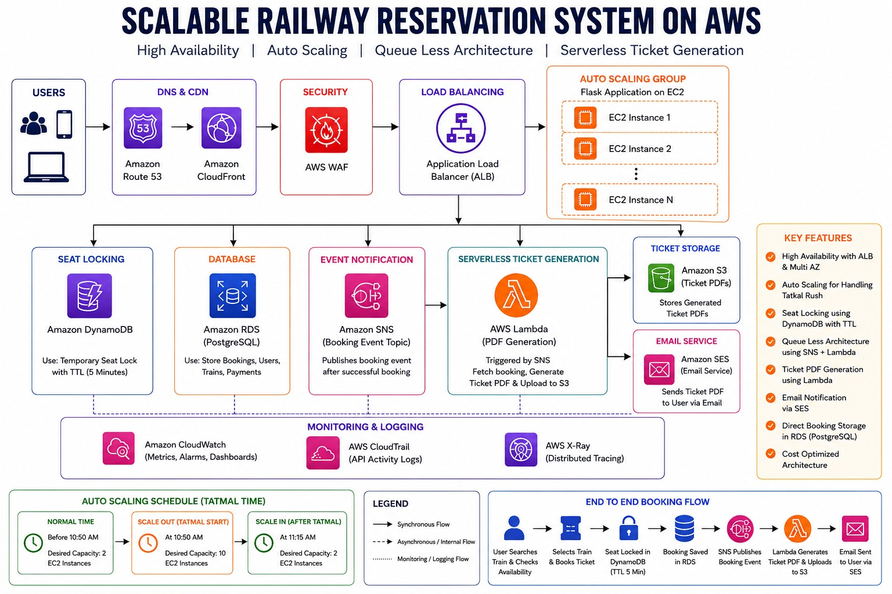
</p>

### Key AWS service components

<table>
  <tr>
    <td align="center">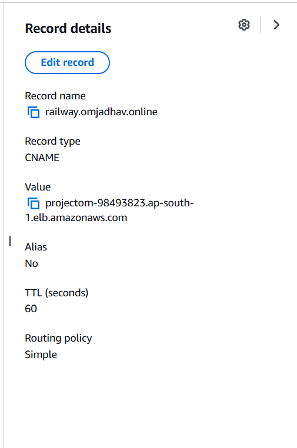</td>
    <td align="center">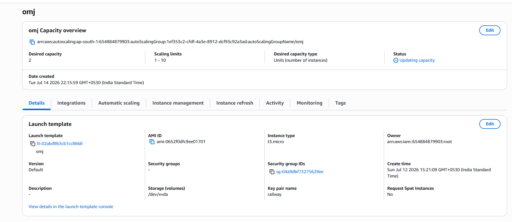</td>
    <td align="center">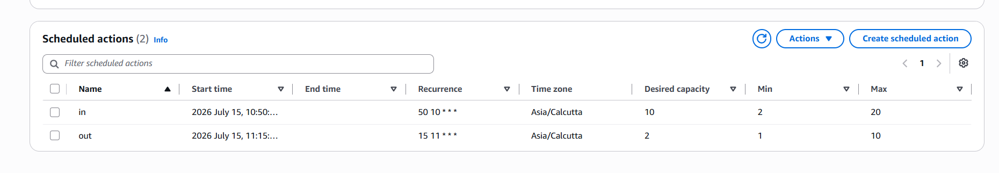</td>
    <td align="center">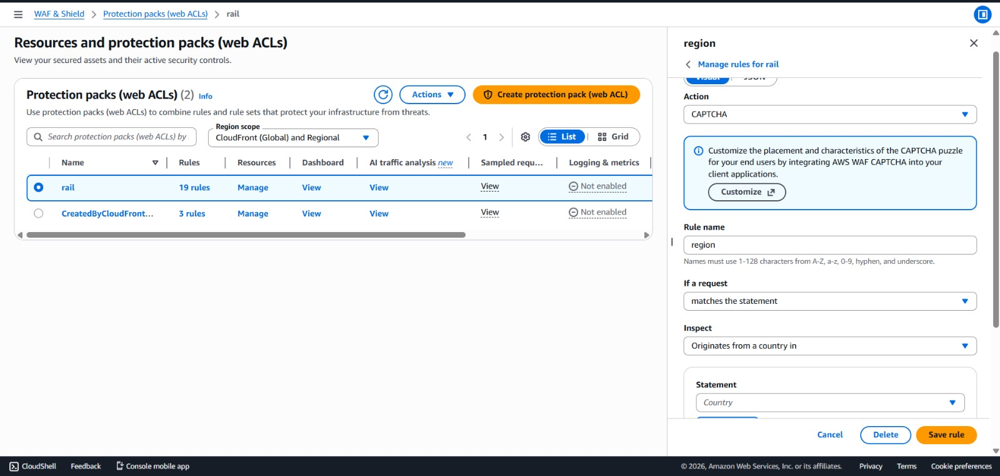</td>
  </tr>
  <tr>
    <td align="center">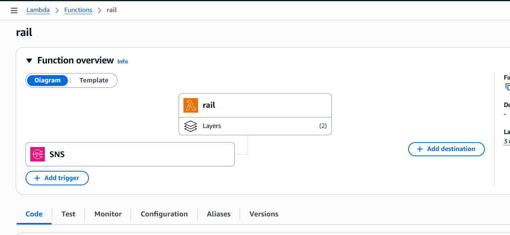</td>
    <td align="center">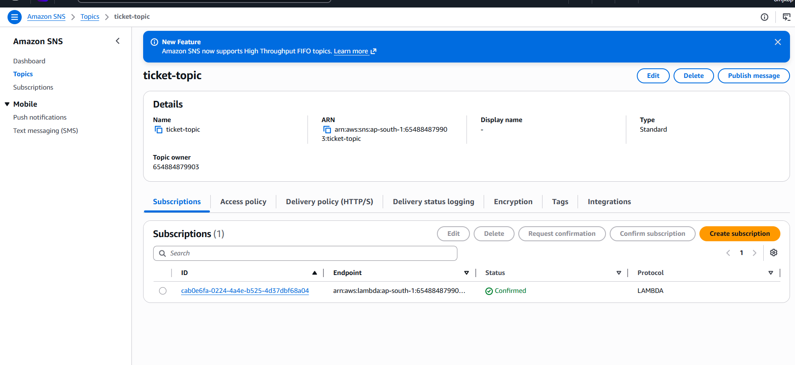</td>
    <td align="center">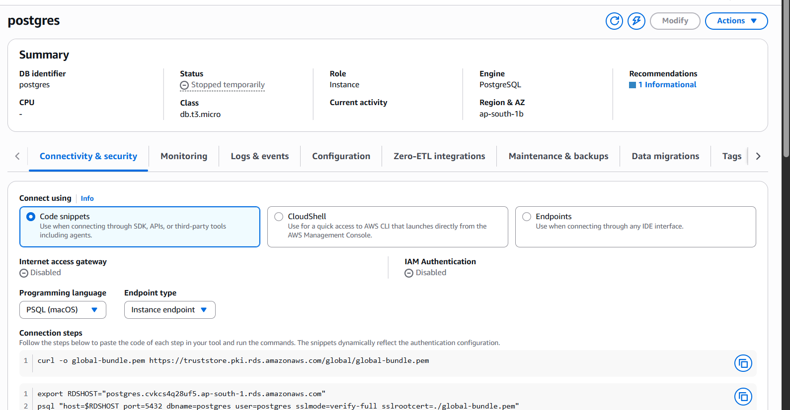</td>
    <td align="center">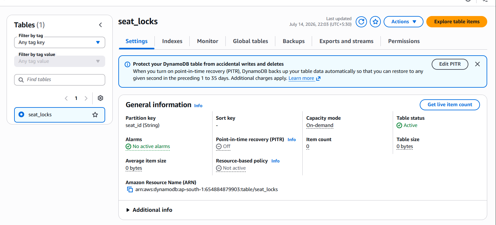</td>
  </tr>
  <tr>
    <td align="center">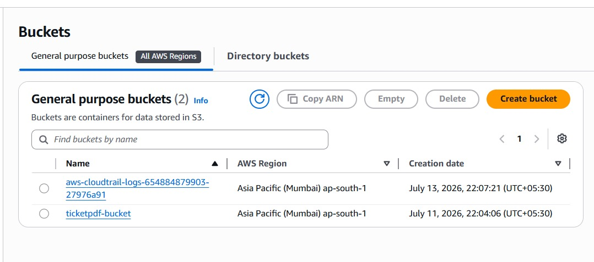</td>
    <td align="center"></td>
  </tr>
</table>

---

# 🔄 End-to-End Booking Workflow

```text
User Login
      │
      ▼
Search Train
      │
      ▼
Check Availability
      │
      ▼
Temporary Seat Lock
(DynamoDB TTL)
      │
      ▼
Booking Saved
(Amazon RDS)
      │
      ▼
SNS Publishes Event
      │
      ▼
Lambda Triggered
      │
      ▼
Generate Ticket PDF
      │
      ▼
Upload PDF to S3
      │
      ▼
Send Email using SES
```

---

# ⚡ Auto Scaling Strategy (Tatkal Simulation)

| Time | Action | EC2 Instances |
|------|--------|--------------:|
| Before 10:50 AM | Normal Traffic | 2 |
| 10:50 AM | Scale Out | 10 |
| After 11:15 AM | Scale In | 2 |

This simulates the **Tatkal booking rush**, ensuring the application automatically scales during peak demand.

---

# 🛠 Technology Stack

## Backend

- Python
- Flask

## Frontend

- HTML
- CSS
- Bootstrap
- JavaScript

## Database

- Amazon RDS PostgreSQL
- Amazon DynamoDB

## AWS Services

- Amazon EC2
- Auto Scaling Group
- Application Load Balancer
- Amazon Route 53
- Amazon CloudFront
- AWS WAF
- Amazon SNS
- AWS Lambda
- Amazon S3
- Amazon SES
- Amazon CloudWatch
- AWS CloudTrail
- AWS X-Ray

---

# 📊 Monitoring & Logging

### Amazon CloudWatch

- EC2 Metrics
- ALB Metrics
- Lambda Monitoring
- RDS Monitoring
- Application Logs
- Dashboards
- CloudWatch Alarms

### AWS CloudTrail

- API Activity Logs
- Resource Changes
- IAM Activity
- Security Auditing

### AWS X-Ray

- Request Tracing
- Database Calls
- Lambda Execution
- Service Performance
- End-to-End Request Analysis

---

# 📂 Project Structure

```text
railconnect_flask/
│
├── app.py
├── lambda_function.py
├── Procfile
├── requirements.txt
├── railconnect.db
├── schema-postgres.sql
├── README.md
│
├── awsimg/              # AWS architecture & service images used in this README
│   ├── arch.jpg
│   ├── auto-scaling.png
│   ├── dynamoDB.png
│   ├── lambda.png
│   ├── RDS.png
│   ├── route53.png
│   ├── s3-bucket.jpeg
│   ├── schedule-autoscaling.png
│   ├── sns.png
│   └── WAF.jpeg
│
├── projimg/            # App UI screenshots used in this README
│   ├── home_page.png
│   ├── login.png
│   ├── Register.png
│   ├── booking.png
│   ├── my_booking.png
│   └── booked_ticket.png
│
├── static/
│   ├── app.js
│   ├── payment-demo.js
│   ├── payment-modal-ui.js
│   └── styles.css
│
└── templates/
    ├── base.html
    ├── auth.html
    ├── admin.html
    ├── index.html
    ├── book.html
    ├── my_bookings.html
    └── ticket.html
```

---

# 🚀 Future Enhancements

- Payment Gateway Integration
- QR Code Based Ticket Verification
- Live Train Status
- AI Seat Recommendation
- Mobile Application
- Multi-language Support

---

# 👨‍💻 Author

## Om Jadhav

**AWS Cloud & DevOps Enthusiast**

- GitHub: https://github.com/omcloud4
- LinkedIn: https://www.linkedin.com/in/om-jadhav-55477a252/

---

<div align="center">

### ⭐ If you found this project useful, consider giving it a Star.

</div>

